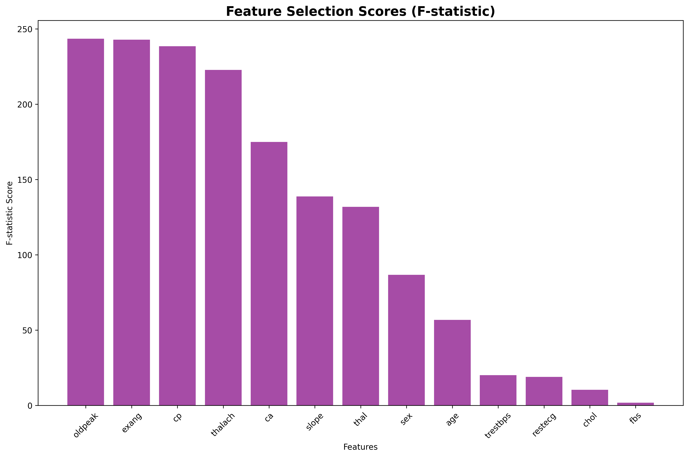

# 🩺 Task 5: Heart Disease Classification – Tree-Based Models

## 📌 Objective
To implement and compare classification models including Decision Tree, Random Forest, and Gradient Boosting on a heart disease dataset. This task includes model training, hyperparameter tuning, visualization, and evaluation.

---

## 🛠️ Tools & Libraries Used

- **Python**  
- **Pandas**  
- **NumPy**  
- **Matplotlib**  
- **Seaborn**  
- **scikit-learn**

---

## 📁 Project Structure

| File/Folder                         | Description                                                 |
|-------------------------------------|-------------------------------------------------------------|
| `heart.csv`                         | Original dataset (heart disease features + target)          |
| `task5_tree_models.py`              | Main Python script performing classification & analysis     |
| `outputs/`                          | Folder with all saved visualizations (charts, trees, etc.)  |
| `README.md`                         | Documentation of the task                                   |

---

## 🔍 Workflow Overview

1. **Loaded and explored the dataset**  
2. **Performed feature scaling** using StandardScaler  
3. **Selected top 10 features** using SelectKBest (F-statistic)  
4. **Split the data** into training and testing sets  
5. **Trained 3 models**: Decision Tree (with GridSearchCV), Random Forest, Gradient Boosting  
6. **Evaluated models** using Accuracy, Precision, Recall, F1-score, ROC & PR curves  
7. **Visualized** dataset, tree structures, feature importance, and model comparisons  

---

## 📊 Evaluation Metrics

| Model             | Accuracy   | Precision | Recall | F1-Score |
|------------------|------------|-----------|--------|----------|
| **Decision Tree** | ~ Printed in Console |
| **Random Forest** | ~ Printed in Console |
| **Gradient Boosting** | ~ Printed in Console |

> 📌 *Exact metrics will be displayed after running the script.*

---

## 📈 Visualizations

### 1. 📊 Dataset Overview
General distributions for age, cholesterol, heart rate, etc.  


### 2. 🧬 Correlation Heatmap
Shows correlations between features and target.  


### 3. 🌟 Feature Importance Comparison
Bar plots for the top 10 features across models.  


### 4. 🧠 Model Accuracy Comparison
Compares accuracy of all 3 models.  


### 5. 📉 ROC Curve Comparison
ROC curves for all 3 models.  


### 6. 📊 Precision-Recall Curve Comparison
Precision-Recall curves for all 3 models.  


### 7. 🧾 Confusion Matrices
Side-by-side confusion matrices.  


### 8. 🌳 Optimized Decision Tree Visualization
Tree structure after hyperparameter tuning.  


### 9. 🧪 Learning Curves
Tree depth vs cross-validation accuracy.  


### 10. 🔍 Feature Selection Scores
F-statistic scores from SelectKBest.  


---

## ▶️ How to Run

```bash
pip install pandas numpy matplotlib seaborn scikit-learn
python task5_tree_models.py
